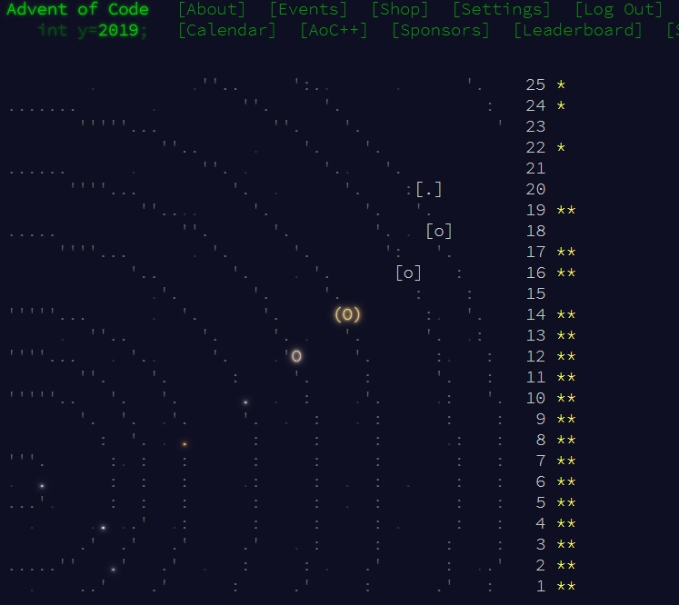

# Advent of Code

Code for my Advent of Code submissions.

```
Year       Language   Stars
2020         Python     48*
2019         Python     37*
```

Feel free to comment, bash the code, suggest improvements, and use it however you like.

# aoc19



# aoc20

2020 done in Python. Average time for Part 1: `03:38:44` Average time differential: `01:18:35`

Am happy that I could get a star for every day at least, with a total of 48\* this year and also a few sub-1000 ranks.

Days `6,8,12,13` were partially written on my phone...

Days `7,8,12,20,22,24` I had real life obligations

```
      --------Part 1--------   --------Part 2--------
Day       Time   Rank  Score       Time   Rank  Score
 25   00:59:02   3208      0          -      -      -
 24   10:59:28   9867      0   11:12:52   8528      0
 23   00:21:00    540      0   02:11:57   1617      0
 22   08:55:21  11358      0   10:36:21   8856      0
 21   00:34:17   1312      0   00:36:28    912      0
 20   23:04:29  11915      0       >24h   6827      0
 19   09:25:01   8615      0          -      -      -
 18   01:30:49   4308      0   02:01:10   3748      0
 17   01:11:54   3114      0   01:42:42   3490      0
 16   00:23:09   2525      0   00:56:00   1626      0
 15   00:15:18   1274      0   00:17:34    638      0
 14   00:33:43   3175      0   01:10:29   2889      0
 13   00:35:01   5940      0   03:08:38   4541      0
 12   04:55:00  13395      0   08:29:00  16023      0
 11   00:51:40   4504      0   01:40:26   4985      0
 10   00:04:22    166      0   02:15:13   6433      0
  9   00:09:59   2138      0   00:29:50   4076      0
  8   00:39:14   7945      0   10:52:34  28507      0
  7       >24h  49301      0       >24h  44530      0
  6   00:22:10   7000      0   00:36:49   6413      0
  5   00:27:16   4971      0   00:41:48   5405      0
  4   00:09:12   1205      0   01:19:26   5855      0
  3   00:20:25   4868      0   00:24:34   3881      0
  2   00:12:47   2958      0   00:16:47   2407      0
  1   00:07:44    976      0   00:09:44   1023      0
```